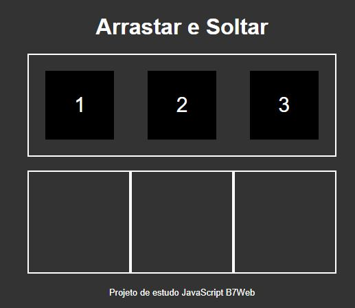

# Projeto-Arrasta-e-Solta

<h2>Conhecimentos obtidos com o projeto</h2>

<ul>
    <li>Como deixar um elemento "arrastável" no HTML5.</li>
    <li>Como mover um elemento de lugar através do JavaScript.</li>
    <li>Manipulação de funções.</li>
    <li>Manipulação de Arrays.</li>
    <li>Propriedades: <b>dragover, dragleave, drop.</b> </li>
</ul>

<h2>Captura de tela:</h2>

